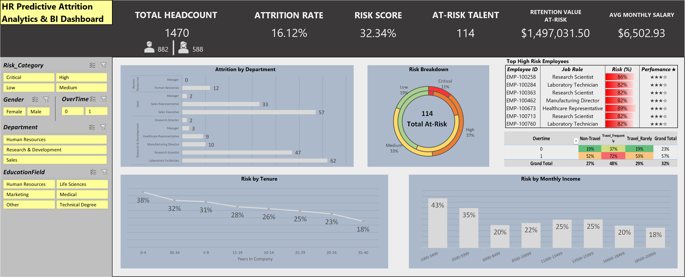

# hr-predictive-attrition-risk-dashboard
An interactive Excel BI tool using weighted risk scoring to predict employee attrition and provide actionable HR insights.
# HR Predictive Analytics: Attrition Risk Dashboard

## 📊 Project Overview
This project transforms a raw dataset of 1,470 employees into a predictive BI tool. Using a weighted risk scoring model, it identifies high-risk employees before they leave, allowing HR to take proactive retention measures.

## 🚀 Key Findings & Strategic Insights

Through statistical correlation analysis ($r$) of 1,470 employee records, the following drivers were identified as the primary causes of attrition:

* **The "Burnout" Factor (Primary Driver):** Overtime is the #1 predictor of attrition, with a relative weight of **10.0**. Employees working overtime are significantly more likely to leave than those who do not, regardless of their job satisfaction levels.
    
* **The Compensation Gap:** Monthly Income is the second strongest driver (**Weight: 6.49**). The data reveals a "Pay Floor"—attrition risk spikes for employees earning below $5,000/month, suggesting that financial stability is a baseline requirement for retention in this cohort.

* **The "Brain Drain" Alert:** Interestingly, employees with a **Performance Rating of 4** (Top Talent) show a similar risk profile to those with a 3. This indicates a "Brain Drain" scenario where the company's highest contributors are just as likely to exit as average performers.

* **Fatal Combinations (Work-Life Intersection):** The "Stress Heatmap" revealed that the combination of **Frequent Business Travel** (Weight: 5.16) and **Overtime** creates a cumulative risk effect. Employees subject to both conditions fall into the "Critical Risk" tier (>75% probability of exit) faster than any other demographic.

* **Tenure "Danger Zone":** Attrition risk is not linear. A significant spike in risk was identified at the **2nd year** mark, suggesting a need for enhanced "Stay Interviews" and career pathing discussions during this critical window of the employee lifecycle.

## 🧠 The Predictive Logic
Unlike standard descriptive dashboards, this tool uses a **Weighted Factor Model**. 
Weights were determined via statistical correlation ($r$) in Excel:

| Factor | Weight | Logic |
| :--- | :--- | :--- |
| **Overtime** | 10.0 | Strongest positive correlation with attrition |
| **Monthly Income** | 6.49 | Below-average pay significantly increases exit probability |
| **Job Satisfaction** | 4.20 | Qualitative engagement driver |

**Risk Formula:** $$RiskScore = \frac{\sum (Factor \times Weight)}{\sum AllWeights}$$

## 🛠️ Tech Stack & Features
* **Excel Power User:** Pivot Engines, Power Pivot, and Advanced Formula logic.
* **BI Design:** Grid-based layout with interactive slicers and dynamic "Actionable Watchlist."
* **Predictive Modeling:** Correlation-based weighting and multi-factor risk categorization.

## 📂 Files in this Repo
* `Predictive_Attrition_Dashboard.xlsx`: The full interactive tool.
* `HR_Analytics_Report.pdf`: A static view of the analytics for quick review.
